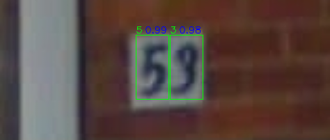
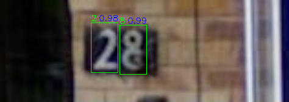
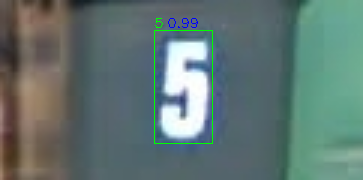

# 2025VRDL-hw2
2025 Visual Recognition using Deep Learning hw2
Student id: 313551056
Name: 王力得

## Introduction
This repository implement a 100-class classification task with faster-rcnn. It may achieve 0.39 mAP and 0.84 accuracy on the public test data.
## Installation
This project runs on python version 3.10.16 with cuda 12.4. It is recommended to use Conda to create a virtual environment.

1. clone the repository and enter the directory by the following command (you may need to install 'git', or alternatively you may download the zip file from the github website):

```bash
git clone https://github.com/n9maple/2025VRDL-hw2.git
```

2. Create a virtual environment with Conda:

```bash
conda create -n hw2 python=3.10.16
```

3. Activate the environment and download the packages:

```bash
conda activate hw2
pip install requirements.txt # Make sure you are using cuda 12.4
```

## Run the code
Please make sure you have download the dataset and the dataset are orginized. The directory should be like:
```bash
data
├── train.json
├── valid.json
├── test
│   ├── 0.png
│   ├── 1.png
│   ├── 2.png
    ...
├── train
│   ├── 0.png
│   ├── 1.png
│   ├── 2.png
    ...
└── valid
    ├── 0.png
    ├── 1.png
    ├── 2.png
    ...
```
1. Activate the environment

```bash
conda activate hw2
```

2. Run the training code.
```bash
python train.py
```
By default, you don't need to add any arguments to run train.py, but you can check the arguments list by the following command:

```bash
python train.py -h
```

3. Run the inference code. If you have run train.py, you may ignore all the arguments and run inference.py. Otherwise, if the model weight path is not given, it will find *'save_model/model_epoch10.pth'*. You may download the weight from the link: 
https://drive.google.com/file/d/1Pxk4rW4FRhF2jMKQQLBNAk2mZWKath88/view?usp=sharing

```bash
python prediction.py
```
or

```bash
python prediction.py --model_path [your_model_path]
```

The prediction results will be saved in "save_result" folder by default.

## Performance Snapshot 
green number is the label, and blue number is prediction confidence score
<figure>
  
</figure>

<figure>
  
</figure>

<figure>
  
</figure>

<figure>
  
</figure>